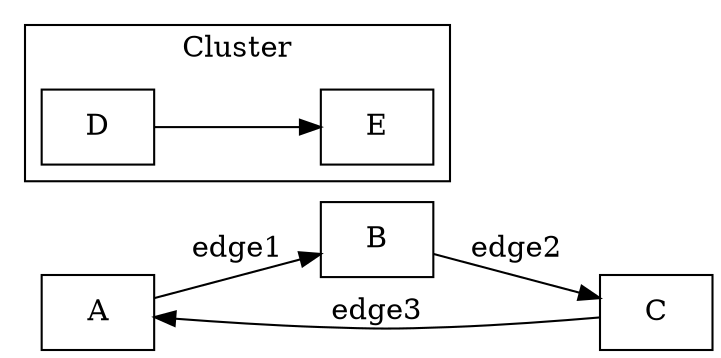

# DOT-LS LSP 测试客户端使用指南

## 改进的客户端功能

### 1. 主要文件

- `client.lua` - 完整的 LSP 测试客户端
- `interactive_test.lua` - 交互式测试脚本  
- `json.lua` - 自定义 JSON 编码器（无需外部依赖）
- `run_test.sh` - 自动化测试脚本
- `test_config.lua` - 测试配置文件

### 2. 使用方法

#### 运行完整测试序列：
```bash
cd /Users/yalla/code/cpp/dot-ls/client
lua client.lua
```

#### 运行交互式测试：
```bash
cd /Users/yalla/code/cpp/dot-ls/client
lua interactive_test.lua
```

#### 使用自动化脚本：
```bash
cd /Users/yalla/code/cpp/dot-ls
./client/run_test.sh              # 默认测试
./client/run_test.sh interactive  # 交互式测试
./client/run_test.sh performance  # 性能测试
```

### 3. 测试内容

客户端会测试以下 LSP 功能：

1. **初始化流程**：
   - `initialize` 请求
   - `initialized` 通知

2. **文档生命周期**：
   - `textDocument/didOpen` - 打开文档
   - `textDocument/didChange` - 文档变更
   - `textDocument/didClose` - 关闭文档

3. **语言功能**：
   - `textDocument/completion` - 代码补全
   - `textDocument/hover` - 悬停信息

4. **关闭流程**：
   - `shutdown` 请求
   - `exit` 通知

### 4. 输出说明

客户端会输出详细的日志信息：
- `INFO` - 测试阶段信息
- `SEND` - 发送的请求/通知
- `DEBUG` - 完整的 JSON 消息内容

### 5. 测试 DOT 文档示例



### 6. 故障排除

如果遇到问题：

1. 确保 dot-ls 服务器已编译：
   ```bash
   cd /Users/yalla/code/cpp/dot-ls
   make
   ```

2. 检查服务器路径：
   ```bash
   ls -la build/Debug/dot-ls
   ```

3. 检查 Lua 是否可用：
   ```bash
   lua -v
   ```

### 7. 扩展测试

要添加更多测试用例，可以修改 `client.lua` 中的 `run_test_sequence` 函数，添加新的 LSP 方法调用。

### 8. 预期结果

成功的测试应该：
- 发送所有测试消息而不出错
- 服务器应该响应 `initialize` 请求
- 所有通知应该被正确处理
- 测试完成后进程正常退出

这个改进的测试客户端提供了完整的 LSP 协议测试覆盖，帮助验证您的 dot-ls 服务器实现。
