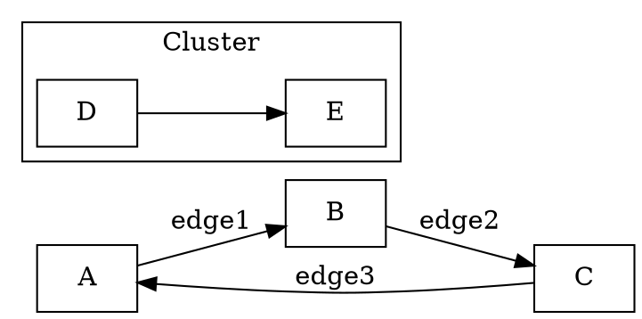

# DOT-LS LSP 测试客户端使用指南

## 客户端功能

### 1. 主要文件

- `client.lua` - 底层管道测试客户端（通过 stdio 直接与 dot-ls 交互）
- `test_completion.lua` - 补全功能测试套件
- `test_document.lua` - 文档生命周期测试套件（didOpen/didChange/didSave/didClose）
- `run_test.sh` - 自动化测试入口脚本

### 2. 使用方法

#### 使用自动化脚本（推荐）：
```bash
cd /Users/yalla/code/cpp/dot-ls
./client/run_test.sh              # 默认：运行 completion + document 测试套件
./client/run_test.sh completion   # 仅运行补全测试
./client/run_test.sh document     # 仅运行文档协议测试
./client/run_test.sh performance  # 性能测试（补全测试跑 5 次并计时）
./client/run_test.sh help         # 显示帮助
```

#### 直接运行单个 Lua 脚本：
```bash
cd /Users/yalla/code/cpp/dot-ls/client
lua test_completion.lua ../build/Debug/dot-ls
lua test_document.lua   ../build/Debug/dot-ls
```


### 3. 测试内容

客户端会测试以下 LSP 功能：

1. **初始化流程**：
   - `initialize` 请求
   - `initialized` 通知

2. **文档生命周期**：
   - `textDocument/didOpen` - 打开文档
   - `textDocument/didChange` - 文档变更
   - `textDocument/didClose` - 关闭文档

3. **语言功能**：
   - `textDocument/completion` - 代码补全
   - `textDocument/hover` - 悬停信息

4. **关闭流程**：
   - `shutdown` 请求
   - `exit` 通知

### 4. 输出说明

客户端会输出详细的日志信息：
- `INFO` - 测试阶段信息
- `SEND` - 发送的请求/通知
- `DEBUG` - 完整的 JSON 消息内容

### 5. 测试 DOT 文档示例


```dot
digraph G {
    rankdir=LR;
    node [shape=box];
    
    A -> B [label="edge1"];
    B -> C [label="edge2"];
    C -> A [label="edge3"];
    
    subgraph cluster_0 {
        label="Cluster";
        D -> E;
    }
}
```

### 6. 故障排除

如果遇到问题：

1. 确保 dot-ls 服务器已编译：
   ```bash
   cd /Users/yalla/code/cpp/dot-ls
   make
   ```

2. 检查服务器路径：
   ```bash
   ls -la build/Debug/dot-ls
   ```

3. 检查 Lua 是否可用：
   ```bash
   lua -v
   ```

### 7. 扩展测试

要添加更多测试用例，可以在 `test_completion.lua` 或 `test_document.lua` 中按照现有的测试用例
（`check(...)` / `assert_true(...)` 断言模式）添加新的 LSP 方法调用与校验逻辑。

### 8. 预期结果

成功的测试应该：
- 发送所有测试消息而不出错
- 服务器应该响应 `initialize` 请求
- 所有通知应该被正确处理
- 测试完成后进程正常退出

这个改进的测试客户端提供了完整的 LSP 协议测试覆盖，帮助验证您的 dot-ls 服务器实现。
